```{r setup, include=FALSE}
library(learnr)
knitr::opts_chunk$set(echo = FALSE)
```

{width="75%"}

## Overview

This tutorial looks at resolving conflicts in _git_.

Conflicts arise when changes are made by different commits which _git_ cannot reconcile automatically.
User intervention is required to make sense of the intent of the changes by manually reconciling changes.

<span class="copyright">© Copyright 2018, 2021 UNSW Sydney. All rights reserved except where otherwise stated.</span>

## The edit $\leftrightarrow$ commit cycle.

Let's remind ourselves of the _git_ edit cycle:

<div class="centre">

</div>

In this cycle it is possible that when we ask for an update concerning changes other people have made independently of our changes
we might find that they have done something different to a section of a file that we also changed.
When this happens _git_ will ask us to fix it and then we will need to communicate the fix back to everyone else.

<div class="centre">

</div>

Fixing these conflicts _is just like any other edit operation_: the aim is to leave the project in a consistent sensible state.

## Conflicts

When multiple copies of a project are worked on concurrently:

  * by multiple users with their own copies
  * by a single user with multiple copies

a situation can arise where _different_ changes are made to the _same_ section of a file.

Generally, _git_ can handle the following concurrent edit scenarios:

  1. changes to different 'non-overlapping' sections of files
  2. identical changes to the same section of a file
  3. changes to one section of a file by one user where no change has been made to that section by other users
     * this is really a special case of scenario (1)

## Tracking the locations of change

<div class="aside">
### An aside...

We shall be discussing and examining example of conflicts in _text_ files which are tracked on a line-by-line basis by _git_.
Non-text files such as images or compressed file and so on are not handled line-by-line when it comes to conflicts.
_Git_ stores binary file and changes to those files in an efficient manner but since it is hard to show changes to a binary
file in a sensible way, resolving conflicts on binary files is generally an all-or-nothing affair:
the entirety of one or the other of two conflicting versions (or a completely new version) is chosen.
</div>

_Git_ tracks the location of changes, not by line number
(which can change when edits are made in prior sections of a file)
but by _context_.

You may have noticed when looking at _diffs_ and logs of commit changes that a few lines either side of a change
are usually presented along with the change.
This is how _git_ locates where to apply a change to a file even when text within the file moves around.
Think of them as _anchor points_ for the changes to be applied.

_Git_ has trouble applying a change if:

  * one or both of the anchor contexts have disappeared
  * two different changes have been made to the text between the start and end contexts

When this happens _git_ will alert us to the _conflict_ and ask for it to be resolved.

In order for such conflicts to always be noticed, _git_ does not allow a _push_ to a remote repository
when the local repository is out-of-date, _i.e._ when the remote repository has 'more changes in it' than the local repository.
(That's a bit hand-wavy but it will do for now.)

When this happens, _git_ requires a _pull_ be made before the _push_ can occur.
When the _pull_ is made, conflicts will be detected and can (and must) be fixed.
(If a _push_ were allowed to the remote repository, conflicts could build up remotely and never get fixed;
a user would one day do a _pull_ and find 100 conflicts waiting to be fixed!)

## Identifying conflicts

Conflicts are indicated in the text using marker character strings:

  * `<<<<<<<` marks the beginning of the area that needs fixing
  * `=======` separates the two different versions, and
  * `>>>>>>>` marks the end of the area that needs fixing

```
<<<<<<< HEAD
my changes
=======
pulled changes
>>>>>>> be2b0441bebfb70c6eef9827678bbb12f149bf4d
```

The aim is to replace the entire section with the 'correct' version.
What is 'correct' is entirely up to you.

  * You might decide your changes are better than the remote changes you're pulling in
    so you delete the markers and the second chunk of text
  * You might decide that the remote changes are better and your changes are unwanted so you keep the second chunk and delete the first
  * You might need to incorporate changes from both, replacing the entire section
  * You might come up with a completely new replacement that is nothing like either of them
  * You might decide to delete both changes altogether
  
There is no single right answer.

To resolve the conflict, _edit_, _add_ and _commit_ as usual.

Note that there may be more than one set of conflicts in a file.
Make sure you get them all by searching for `<<<<<<<` markers until none are left.

<span class="warning">It is very important not to just check the check box when conflicts happen and blindly commit.</span>

Neglecting to fix the conflicts
will lead to the `<<<<<<<`, `=======` and `>>>>>>>` markers and the different versions of the text getting committed.
This will in turn lead to more conflicts down the track with nested marks and not-so-hilarious results.
Your colleagues will not thank you.

Because _git_ keeps track of all the different versions,
nothing is irreparable if you do this, everything can be fixed as we have a full history of all our files.
Fixing a single accidentally-committed conflict is relatively easy.
Fixing nested conflicts gets messy and confusing very fast so if you accidentally do this, fix it as soon as possible.

## Resolving conflicts

We're going to step through the process of resolving a conflict.

  * One user is going to enter some text (_Clancy of the Overflow_) omitting a few verses and _commit_ it locally
  * This first user is going to _push_ the result to a remote repository
  * A second user is going to _clone_ this project and add some (but not all) of the verses
    and provide a verse which is not the original text
  * The second user will _commit_ these changes (locally) and _push_ the result back to the remote repository
  * _Without pulling_ the first user notices the missing verses and adds them back in and _commits_ them (locally)
  * The first user now tries to _push_ and is told the local repository is out-of-date
  * The first user _pulls_ to get pending remote changes
  * At this point a conflict is discovered
  * The first user will fix the conflict, _commit_ the changes and _push_ the reconciled version of the changes
  * At some later point the second user will _pull_ and get the reconciled version
  * Both users will then have the same changes (and history of changes) in their repositories

## User 1: A new project

For the purposes of this tutorial we will create a new project and push it to _GitHub_.

There are several ways of working on a project under _git's_ control:

  * clone an existing project on _GitHub_ locally
  * create a new project on _GitHub_ and then clone it locally
  * bring an existing project under the control of _git_ and push it into an empty project on _GitHub_
  * create a new empty project locally and push it into an empty project on _GitHub_

We shall be doing the last, so we select _File >> New Project..._ from the menus in _RStudio_,
choose _New Directory_ in the window that pops up,
choose _New Project_ for the _Project Type_,
and then fill in the location where we want to create the project making sure we tick the _Create a git repository_ check box.

In the new project (which we have called `conflict`) we create a new text file called `clancy.txt`
and enter the text of the poem _Clancy of the Overflow,_ by Banjo Patterson.

> I had written him a letter which I had, for want of better,  
> Knowledge, sent to where I met him down the Lachlan, years ago,  
> He was shearing when I knew him, so I sent the letter to him,  
> Just on spec, addressed as follows, “Clancy, of The Overflow”.  
>  
> And an answer came directed in a writing unexpected,  
> (And I think the same was written with a thumb-nail dipped in tar)  
> ’Twas his shearing mate who wrote it, and verbatim I will quote it:  
> “Clancy’s gone to Queensland droving, and we don’t know where he are.” 
> 
> In my wild erratic fancy visions come to me of Clancy  
> Gone a-droving “down the Cooper” where the Western drovers go;  
> As the stock are slowly stringing, Clancy rides behind them singing,  
> For the drover’s life has pleasures that the townsfolk never know.  
> 
> And the bush hath friends to meet him, and their kindly voices greet him  
> In the murmur of the breezes and the river on its bars,  
> And he sees the vision splendid of the sunlit plains extended,  
> And at night the wond’rous glory of the everlasting stars.  
> 
> I am sitting in my dingy little office, where a stingy  
> Ray of sunlight struggles feebly down between the houses tall,  
> And the foetid air and gritty of the dusty, dirty city  
> Through the open window floating, spreads its foulness over all.  
> 
> And in place of lowing cattle, I can hear the fiendish rattle  
> Of the tramways and the buses making hurry down the street,  
> And the language uninviting of the gutter children fighting,  
> Comes fitfully and faintly through the ceaseless tramp of feet.  
> 
> And the hurrying people daunt me, and their pallid faces haunt me  
> As they shoulder one another in their rush and nervous haste,  
> With their eager eyes and greedy, and their stunted forms and weedy,  
> For townsfolk have no time to grow, they have no time to waste.  
> 
> And I somehow rather fancy that I’d like to change with Clancy,  
> Like to take a turn at droving where the seasons come and go,  
> While he faced the round eternal of the cash-book and the journal —  
> But I doubt he'd suit the office, Clancy, of The Overflow.

_However,_ we will leave out the second, fourth and sixth verses.

<div class="screenshot">
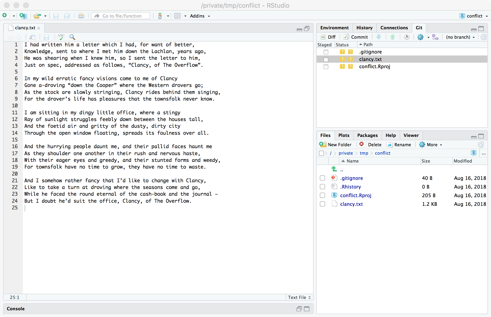{width="100%"}
</div>

Notice at this point we have saved our new text file but we have not added or committed any files to _git's_ care
(as shown by the `?` in the _Status_ column of the _git_ pane).

## User 1: The initial commit

Let's _commit_ all the files of our new project, making sure to tick the _Staged_ box to _add_ them.

Here is our project with a sensible _commit_ message just before we press the _Commit_ button:

<div class="screenshot">
{width="100%"}
</div>

And here it is just after, showing _git's_ output as it performs the _commit:_

<div class="screenshot">
{width="100%"}
</div>

It will be instructive to look at the _git_ history of the project at this point and see the state of the world
as _git_ sees it locally:

<div class="screenshot">
{width="100%"}
</div>

We have only made one _commit_ and where we are working (the green cartouche with `HEAD` in it) is at that commit,
_i.e._ we're working at the most up-to-date place _git_ can be.

<div class="under-the-bonnet">
### Under the bonnet...

We can see a lot of information in this pane:

  * there is only one _commit_ (`dec2beac`) so far (because there is only one line)
  * in this _commit_ we added a bunch of files
  * it was done on 16/8/2018 at 06:59 UTC by James Farrow
  * the `HEAD` (where we're working) is at the tip of the `master` branch (the main line of development)
  * this _commit_ according to the commit message was `Initial commit. Clancy of the Overflow missing verses 2, 4 and 6.`
    (this is why we choose sensible and descriptive commit messages).
</div>

## User 1: Pushing upstream

So far with _git_ we have been adding and committing files to a _local repository._
A repository is a place where _git_ keeps all the information it knows about files and changes.
The local repository is kept in the `.git` directory in the top directory/folder of our project.
<span class="warning">_You should never touch anything in this folder directly unless you know_ exactly _what you are doing._</span>

We can have a _remote repository_ which we can _push_ changes to and _pull_ changes from.
Conventionally this remote repository is called the `origin` and is referred to as being 'upstream' from our local repository.

  * we _push_ changes upstream from our local repository to the `origin`
  * we _pull_ changes from the `origin` to our local repository

The remote repository might have already been in existence (either empty or with files in it) and we cloned it locally to begin work.
This process usually sets up our `master` branch to track changes in the remote `origin/master` branch automatically,
_i.e._ when we _push_ we push changes from our `master` to the `master` branch of the `origin` and
when we _pull_ we pull any changes we don't have yet in our `master` from the `master` branch of the `origin`.

<div class="under-the-bonnet">
### Under the bonnet...

A _pull_ is actually two operations:

  * a _fetch_ from the branch on the `origin` server to a local copy of that remote branch
  * a _merge_ of the local copy of the remote branch to the local working branch

It's usually convenient to use _pull_ to do these operations together.
</div>

In our case we are going to take our existing local repository (the one we have just created)
and _push_ it into an empty remote repository on _GitHub._

First, let's create a new repository on _GitHub_.
We're going to call it `conflict` because we're going to use it to demonstrate edit conflicts.

<div class="screenshot">
{width="100%"}
</div>

_GitHub_ informs us of several ways we can populate our new remote repository

  * we can create a new (local) repository and associate it with the remote repository
  * we can push an existing (local) repository to the remote repository
  * we can import code from another kind of repository
  
Since we already have a repository we're going to follow the second suggestion.

<div class="screenshot">
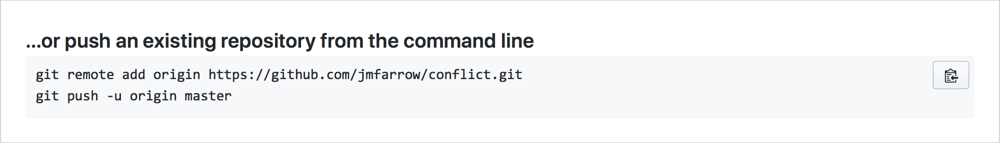{width="100%"}
</div>

We will associate the _GitHub_ remote repository with our local repository by setting it as the `origin`
and then we will push the local repository to the remote repository.

Unfortunately, _RStudio_ has no facilities for setting the `origin` directly.
It would do this for us if we open a new project by cloning a project from _GitHub_
but for our case we will need to open a shell and issue a few _git_ commands to effect the setup.

To do this in _Rstudio_ we'll use the drop-down menu accessed _via_ the cog icon in the _git_ pane
and select _Shell...._

Notice at this point in the _RStudio_ UI the _push_ and _pull_ icons (up and down arrows) on the _git_ tab are inactive.
This is because at this point there is no upstream `origin` repository associated with the local repository.
We're about to change that.

<div class="screenshot">
{width="100%"}
</div>

We open the shell and run two commands:

  * set the upstream `origin` to be the _GitHub_ repository
  * _push_ the local repository to the `origin`

<div class="screenshot">
{width="100%"}
</div>

This has the side-effect of setting up our local `master` branch to track the remote `origin/master` branch
(which is what we want).

Now the _push_ and _pull_ icons (up and down arrows) on the _git_ tab are active.

<div class="screenshot">
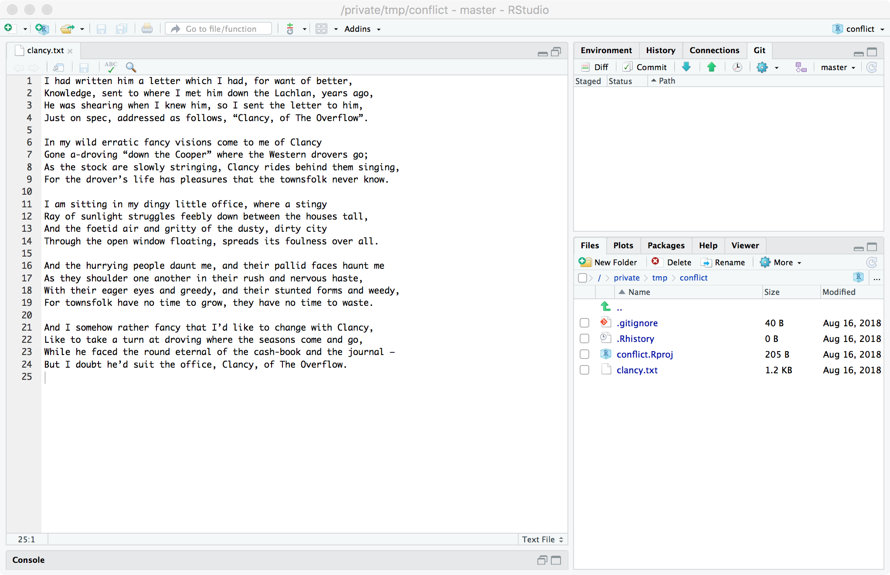{width="100%"}
</div>

In our commit history we can see that we have a new piece of information.
Previously the commit history only had the status of our local repository in it as we saw:

<div class="screenshot">
{width="100%"}
</div>

Now, after adding an `origin` and performing our push we have some new information in the history:
information about the status of the `origin` repository.

<div class="screenshot">
{width="100%"}
</div>

<div class="aside">
### An aside...

It's important to draw the distinction that this is **_not_** a statement about the current status of the `origin` server.
It is a statement about _the local repository's knowledge of the origin server._
These two things can be quite different as the local repository only updates its knowledge about the remote `origin`
on a successful _pull_ or _push_.
Independent interaction with the `origin` by other users may change the state of the `origin` and these changes won't be
known to the local repository until the next _pull._
</div>

So, at this point, from this user's point-of-view, the local repository and the remote repository are synchronised.

Let's have a look at _GitHub_ just to check:

<div class="screenshot">
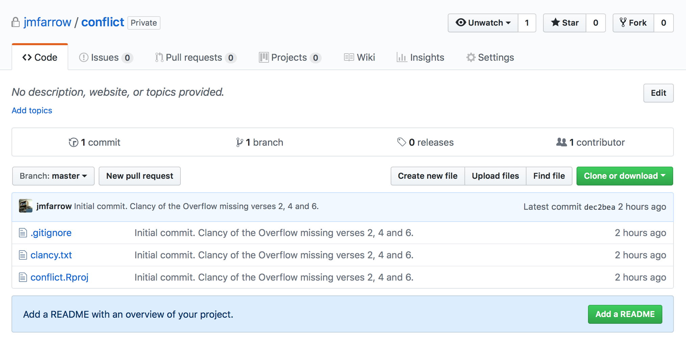{width="100%"}
</div>

## User 2 starts work

At this point, a second user comes along and wants to work on the repository.
This user, let's call him Guy Incognito, goes to _GitHub_ and retrieves the URL to clone the repository
from the repository page.

<div class="screenshot">
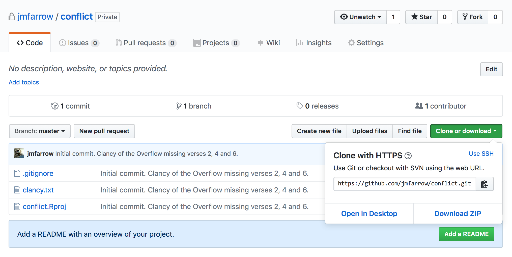{width="100%"}
</div>

In _RStudio_ he selects _File >> New Project..._ from the menu
and undertakes to check out a new project from a version control repository by selecting the _Version Control_ option.

<div class="screenshot">
{width="50%"}
</div>

He choose to clone from a _git_ repository:

<div class="screenshot">
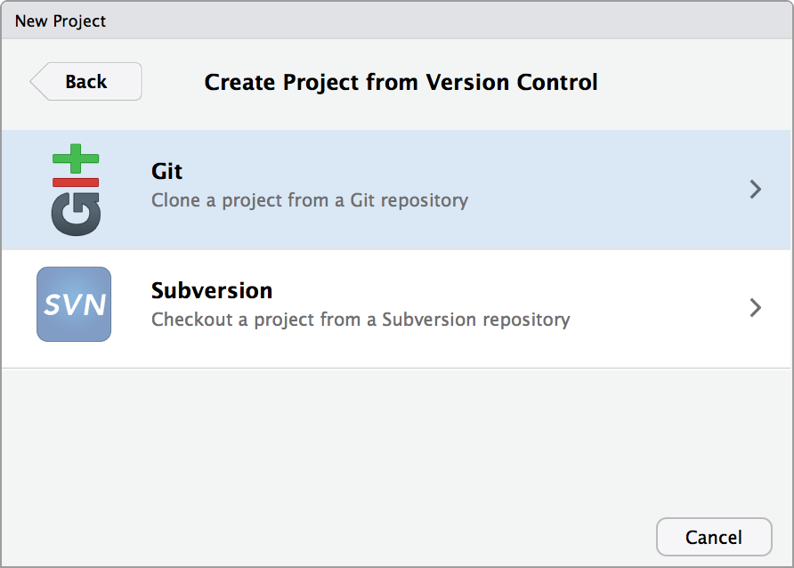{width="50%"}
</div>

and enters the information taken from the _GitHub_ project page to create the new project directory:

<div class="screenshot">
{width="50%"}
</div>

Once this is complete, our new user, Guy, has an up-to-date copy of the repository:

<div class="screenshot">
{width="100%"}
</div>

His local commit history lists shows our local `HEAD` (in green) and his repository's idea of the `origin` repository (grey).

<div class="screenshot">
{width="100%"}
</div>

There is only one commit `dec2beac` and at this point everyone has a copy of it.

## User 2 makes some changes

At this point, User 2 (Guy) decides to add in verse four and an alternative version of verse six.

<div class="screenshot">
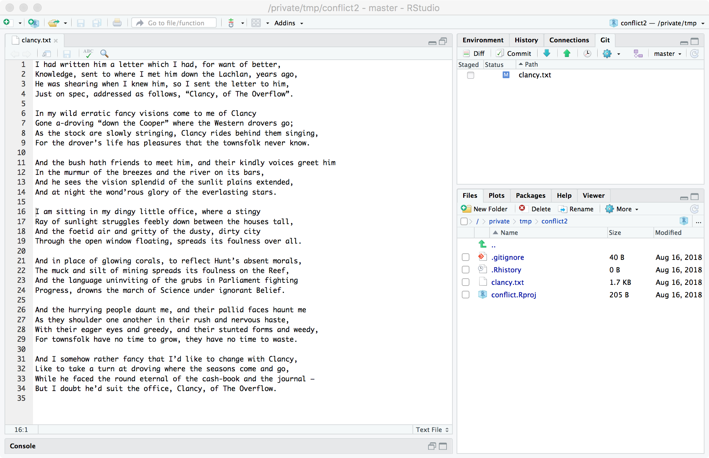{width="100%"}
</div>

We see that Guy has saved his changes so the _git_ pane shows `clancy.txt` as being modified and needing to be committed.

## User 2 commits the changes

Our second user, Guy, commits his changes:

<div class="screenshot">
{width="100%"}
</div>

In this window we can see he has chosen to stage his changes for commit and that he has edited `clancy.txt`
by adding two verses (verse four and verse six)
and has entered a suitably descriptive commit message.

And so, he pushes the _Commit_ button:

<div class="screenshot">
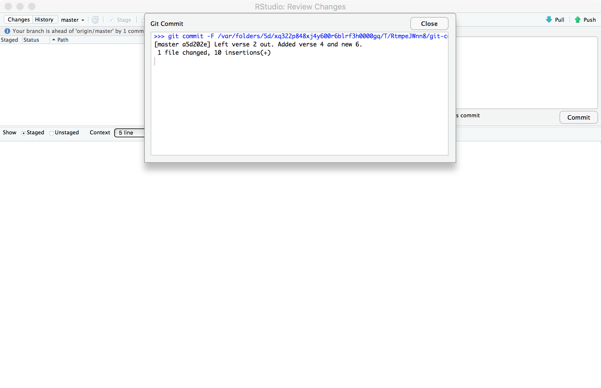{width="100%"}
</div>

If you look carefully in the background, you can see a message which says

> ⓘ️ Your branch is ahead of 'origin/master' by 1 commit

If we look at the commit history we can see this:

<div class="screenshot">
{width="100%"}
</div>

Notice that as far as Guy knows, the `origin/master` still only has one commit (`dec2beac`)
and he has added a second commit (`a5d202e4`) placing his `master` one commit ahead of `origin/master`.

This means there are changes he knows about which the upstream server doesn't.
A _push_ will push those changes to the remote `origin` repository (_GitHub_).

## User 2 pushes

User 2 (Guy) has changes that are not in the upstream repository.
His `master` is one commit ahead of (has one commit that is not in) the `origin/master`.

So he decides to _push:_

<div class="screenshot">
{width="100%"}
</div>

This pushes (shares) his changes with the remote _GitHub_ copy of the repository.
Since the local repository now 'knows' the remote repository has this information,
it updates where it thinks `origin/master` is up to:

<div class="screenshot">
{width="100%"}
</div>

We can see that from Guy's point-of-view, his repository and the remote repository are synchronised.

## User 1: some more edits

At this point, if User 1 did a _pull_, all of User 2's changes would be brought down locally,
User 1 could make further edits and then _push_ back to the remote repository and there will have been
no conflict because all edits would be made sequentially: User 1 then User 2 then User 1 again.

However, if User 1 has not used _pull_ to grab changes from the remote repository
there is no local knowledge of User 2's edits.
In essence User 1 has made the initial edits and now User 1 and User 2 are making changes at the same time.

Let's see what happens.

User 1 realises that verses two, four and six were left out and adds them:

<div class="screenshot">
{width="100%"}
</div>

This is all perfectly normal and User 1 saves the changes so the _git_ pane indicates `clancy.txt` has been modified.

To continue User 1 will need to _commit_ the changes.

## User 1: committing new changes

User 1 commits the new version of `clancy.txt`.
This is all local so there is no problem and no conflict.

<div class="screenshot">
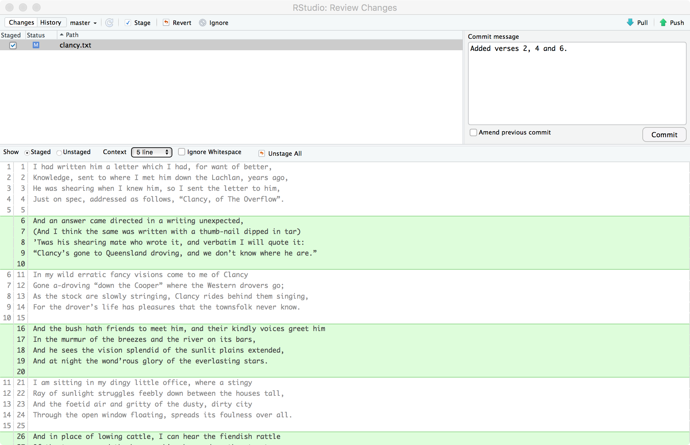{width="100%"}
</div>

We can see that verses two, four and six have been added
and User 1 is being a good team player and entering a sensible commit message.

The _Commit_ button is pressed.
Nothing stops this and no conflict is created because User 1 is only changing the local repository.

<div class="screenshot">
{width="100%"}
</div>

Let's have a look at User 1's commit history:

<div class="screenshot">
{width="100%"}
</div>

This makes sense.
From User 1's point-of-view:

  * the upstream repository only contains one commit (`dec2beac`)
    * remember User 1 has not tried to _pull_ or _push_ yet and so knows nothing about User 2's changes
  * the local repository has a new commit (`549760ee`) with the new changes

User 1 now wishes to share those new changes by using _push_ to send them upstream to the remote repository.

## User 1: A push attempt

User 1 has changes in the local repository which need to be shared so a _push_ is attempted:

<div class="screenshot">
{width="100%"}
</div>

<span class="warning">This _push_ has failed.</span>

It's very easy to fall into the habit of always dismissing this box which pops up after performing a _git_ action.
**It's very important to always check it for errors.**

We see the following text:

```
>>> git push origin refs/head/master
To https://github.com/jmfarrow/conflict.git
 ! [rejected]        master -> master (fetch first)
error: failed to push some refs to 'https://github.com/jmfarrow/conflict.git'
hint: Updates were rejected because the remote contains work that you do
hint: not have locally. This is usually caused by another repository pushing
hint: to the same ref. You may want to first integrate the remote changes
hint: (e.g., 'git pull ...') before pushing again.
hint: See the 'Note about fast-forwards' in 'git push --help' for details.
```

Most of this should be fairly self-explanatory or at least understandable with a little thought:

  * git has tried to push our `master` to the `origin`
  * it failed
  * it failed because there is extra stuff at the `origin` that we don't have
  * it suggests that it might be because someone else has contributed changes (since we last updated)
  * it suggests we might want to pull down the remote changes and incorporate them to continue

So let's pull.

## User 1: Pull

User 1's local repository is behind the remote repository.
As a result, _git_ wants us to update by performing a _pull_ and integrating any changes we haven't yet seen
before it will let us _push_ our outstanding changes.

Because we're about to merge upstream changes with local changes we should
<span class="warning">always make sure there is no outstanding uncommitted work locally before running `git pull`.</span>

The easiest way to ensure this is to make sure we have performed a _commit_ and have committed everything before we _pull_
(_i.e._ there is nothing outstanding in the _git_ pane).

In our case we have just done this.

<div class="under-the-bonnet">
### Under the bonnet...

Sometimes you may not want to _commit_ all your changes.

Without going into detail:

  * you might create a new branch and put your changes there before returning to this branch and merging
  * you might use `git stash` to save all pending changes and `git stash pop` to get them back again after the merge

Don't do either of these until you know what you're doing.
</div>

Let's _pull._

<div class="screenshot">
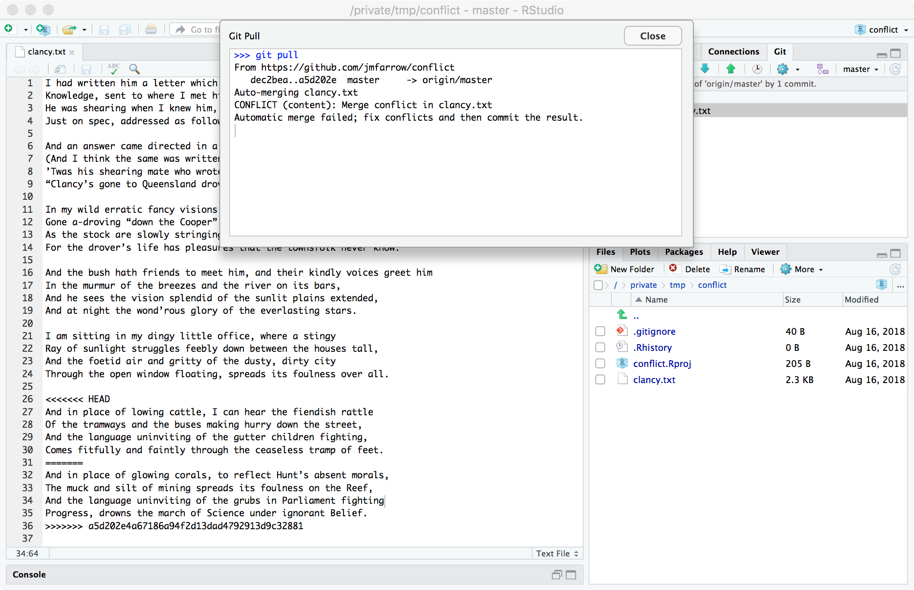{width="100%"}
</div>

This didn't fail, but
<span class="warning">it has warned us there is a merge conflict.</span>

A lot of the time, _git_ can merge changes from other authors into our repository without help.

When that is possible, the _pull_ just merges in all the changes and will _commit_ the result for us.
When we go back and look at the commit history, we'd see something like:

> `Merge branch 'master' of https://github.com/jmfarrow/conflict`

There is no conflict and we can just continue editing and committing and pushing.

In this case however, _git_ could not merge the changes (we'll see why in a moment).

Let's look at the commit history after this _pull:_

<div class="screenshot">
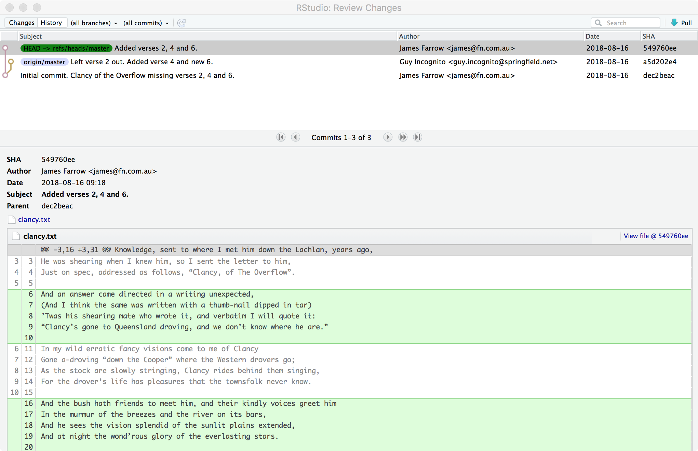{width="100%"}
</div>

Notice that we've now pulled down the commit that User 2 made (`a5d202e4`) and that's where we think `origin` is at.
So

  * our `master` branch has our original work and our new work (`dec2beac` and `549760ee`)
  * the `origin/master` branch has our original work and User 2's work (`dec2beac` and `a5d202e4`)
  * they have diverged and not merged yet (because _git_ couldn't automatically reconcile the differences)

If you look at the _Author_ column you can see who made the contributions.

_Git_ wants us to fix this situation.

<div class="under-the-bonnet">
### Under the bonnet...

_Git_ is actually in the middle of a _merge_ at this point.

It is waiting for us to fix everything and perform a _commit_.

Alternatively, if we get really stuck we can back out of the merge by running

```
git merge --abort
```

on the command line.

Note that `git merge --help` says for `--abort`:

> Abort the current conflict resolution process, and try to reconstruct the pre-merge state.
>
> If there were uncommitted worktree changes present when the merge started, git merge --abort will in some cases be unable to reconstruct these changes.  
> It is therefore recommended to always commit or stash your changes before running git merge.

This was mentioned above.

This only defers things:
it leaves the fetched changes in the local version of `origin/master` but returns `master` to the pre-pull state.
A merge will still have to occur by running `git merge origin` at a later point.

There is no facility for doing any of this in _RStudio_, it all needs to be done on the command line.

It's probably better to just sort out the merge and commit as shown next.
</div>

## User 1: Conflict!

After the _pull_ that results in a conflict,
_git_ leaves us in the middle of its attempt to _merge_ all the changes and wants us to fix things manually.

Let's take a look at the current state of the file:

<div class="screenshot">
{width="100%"}
</div>

There are some things to note:

  * in the _git_ pane, files with unresolved conflicts are shown with a _Status_ of `U`
  * those files will contain _one or more_ sections delimited by `<<<<<<<`, `=======` and `>>>>>>>`

We need to find each of those sections and fix them.

Notice these things about the conflict:

  * our change to verse two _was not a conflict_ because User 2 did not touch that part of the file
  * our change to verse four _was not a conflict_ because User 2 made exactly the same changes
  * our change to verse six **_was a conflict_** because we changed it differently to User 2

Looking in the text we see this:

```
<<<<<<< HEAD
And in place of lowing cattle, I can hear the fiendish rattle
Of the tramways and the buses making hurry down the street,
And the language uninviting of the gutter children fighting,
Comes fitfully and faintly through the ceaseless tramp of feet.
=======
And in place of glowing corals, to reflect Hunt’s absent morals,
The muck and silt of mining spreads its foulness on the Reef,
And the language uninviting of the grubs in Parliament fighting
Progress, drowns the march of Science under ignorant Belief.
>>>>>>> a5d202e4a67186a94f2d13dad4792913d9c32881
```

It's showing us our local change and the remote change and expecting us to remove everything from
`<<<<<<< HEAD` to `>>>>>>> a5d202e4a67186a94f2d13dad4792913d9c32881` (inclusive) and replace it with something sensible.

We can do pretty much anything we want here, it's just a normal _edit $\rightarrow$ commit_
but the available options boil down to one of the following:

  * use the first change (mine) discarding the other (theirs)
  * use the second change (theirs) discarding the first (mine)
  * synthesise the two into a combined solution
  * come up with something completely new and different (including nothing) to use instead

<div class="aside">
### An (humorous) aside...

I had considered for the _synthesis_ example using the first verse
of _Clancy_ and the first verse from _The Raven_ by Edgar Allan Poe,
and synthesising the following:

> I had written him a letter which I had, for want of better,  
> Knowledge, many a quaint and curious volume of forgotten lore,  
> He was shearing when I knew him, so I sent the letter to him,  
> As of some one gently rapping, rapping at my chamber door.
</div>

## User 1: Resolving the conflict

The conflict concerns the edits made for verse six.
There are two different versions:

<div class="screenshot">
{width="100%"}
</div>

We're going to resolve this by choosing our version of verse six, so we edit the file,
removing the markers and the unwanted version, leaving our version.
Here we have saved the file but not yet added it for _commit._

<div class="screenshot">
{width="100%"}
</div>

<div class="anxiety">
### Warning...

<span class="warning">It's very easy to forget to take out _all_ the `<<<<<<<` markers _&c._ or neglect to save the file.</span>

Make sure you get them all by searching for the `<<<<<<<` markers and save the file.

As mentioned previously:

<span class="warning">It is very important not to just check the check box when conflicts happen and blindly commit.</span>

Neglecting to fix the conflicts
will lead to the `<<<<<<<`, `=======` and `>>>>>>>` markers and the different versions of the text getting committed.
This will in turn lead to more conflicts down the track with nested marks and not-so-hilarious results.
Your colleagues will not thank you.

Because _git_ keeps track of all the different versions,
nothing is irreparable if you do this, everything can be fixed as we have a full history of all our files.
Fixing a single accidentally-committed conflict is relatively easy.
Fixing nested conflicts gets messy and confusing very fast so if you accidentally do this, fix it as soon as possible.
</div>

At this point, if we were to edit the file and the result was different to the last version we committed,
_i.e._ we came up with something new or we chose their version over ours, the _RStudio_ _git_ pane UI
would show the file as having been modified when we select the _Staged_ check box to _add_ our changes for _commit._

<div class="screenshot">
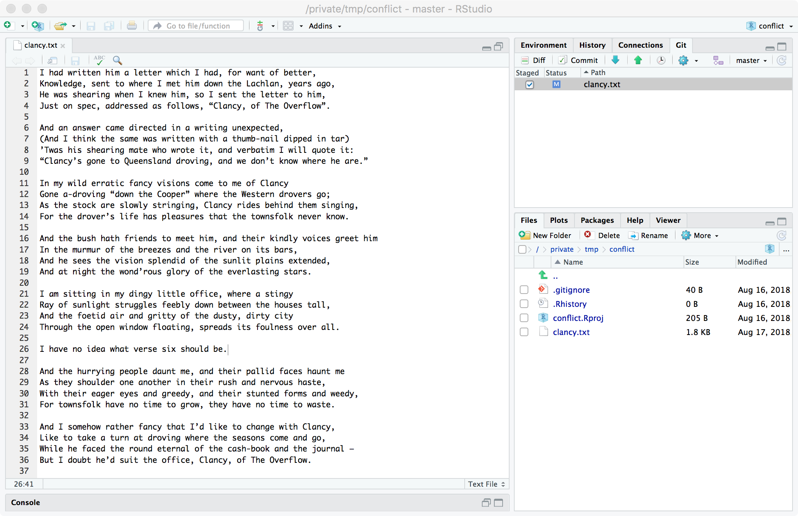{width="100%"}
</div>

However, in this case (which is not an uncommon case),
after our edits _our file is exactly the same as our last committed version._
This means that the _git_ pane will be empty (because it only shows files which are different to our last commit).

<div class="screenshot">
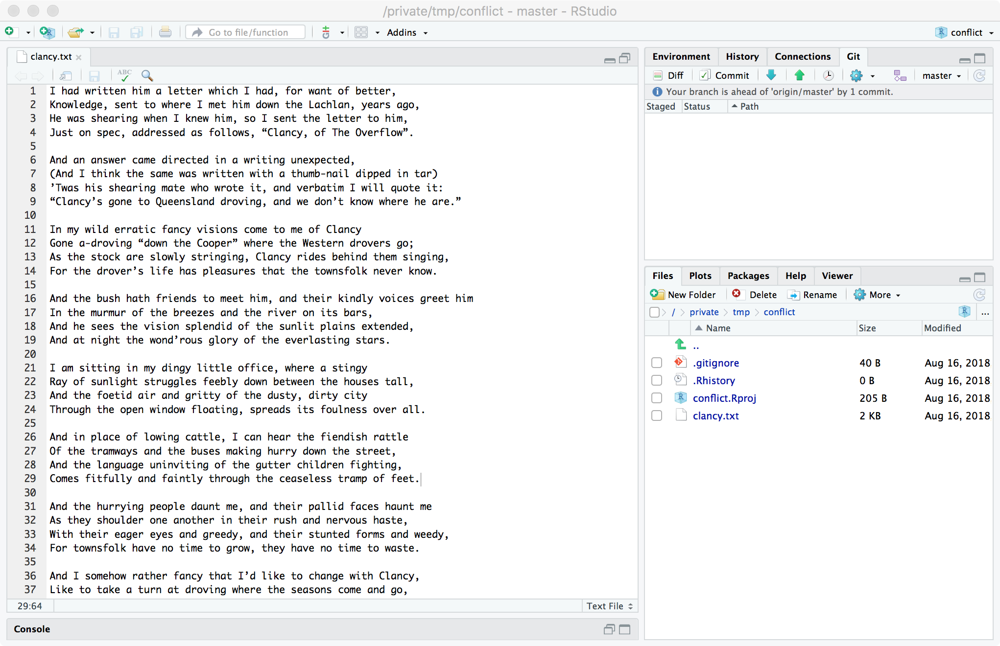{width="100%"}
</div>

This is counter-intuitive:

  * there are changes we need to _commit_ because we have resolved a merge conflict
  * the UI is telling us there are no changes!

The lesson to take away from this is as follows:

<span class="warning">When a _pull_ results in a conflict,
once the editing is complete, always _commit_ afterwards to resolved the conflict</span>
even if the _git_ pane is empty.

_Git_ will remain in a _merge_ state until the next _commit_ so you may get unexpected behaviour.

<div class="aside">
### An aside...

It's no disaster if you forget the _commit_ after resolving conflicts.
Instead of having two commits, one with the resolution of the conflict and one with subsequent changes
you will just have one commit (with both sets of changes).
The result will be the same files, it's just nicer looking back through the commit history to see
one commit for the _pull/merge_ and a separate one for subsequent changes since logically they are distinct.
</div>

Let's do the _commit_ now after having fixed verse six.
Remember we're seeing no change because our current version is the same as the last committed version
but a commit is necessary.

Let's type in a sensible commit message to say what we did.
Also note that our current version is one commit ahead of `origin/master`
(that's our original changes which added verses two, four and six).

<div class="screenshot">
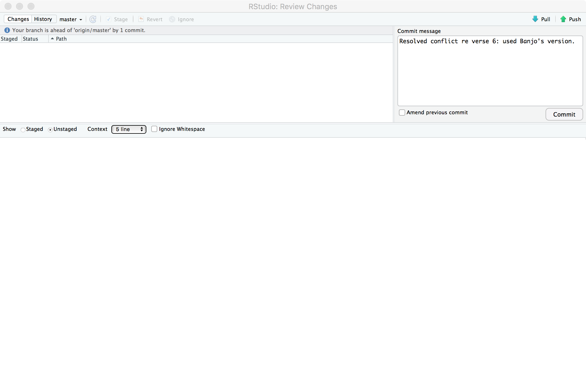{width="100%"}
</div>

And we press the _Commit_ button:

<div class="screenshot">
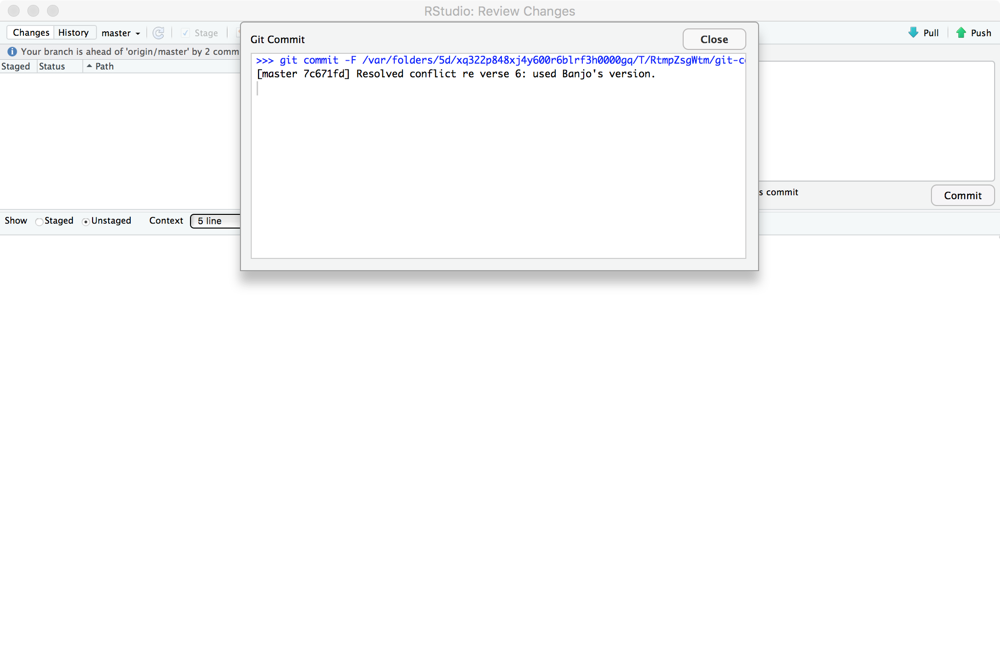{width="100%"}
</div>

Note that now we are ahead of `origin/master` by two commits:

  * our original addition of verses two, four and six
  * the commit we just made to resolve conflicts after the _pull_

Let's look at the commit history to see:

<div class="screenshot">
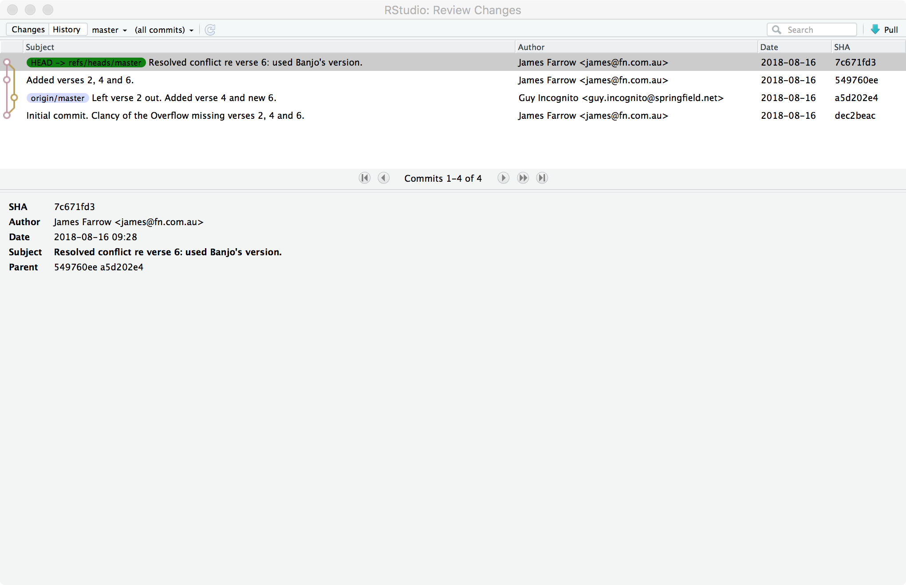{width="100%"}
</div>

There we are: we've reconciled the two different versions and they've merged back together.

As far as we know:

  * our local repository has four sets of changes and we've merged them together and are at that merged version
  * the remote `origin` repository is still behind us and needs to be updated with a _push_

## User 1: Pushing the resolution

Our local repository is ahead of `origin/master` by two commits so we need to _push_ and update the remote repository.

Let's _push:_

<div class="screenshot">
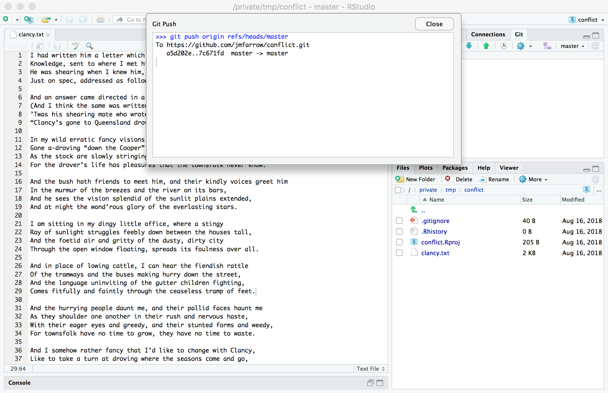{width="100%"}
</div>

This will update our local idea of what's on the remote repository and we can see that if we look at the commit history:

<div class="screenshot">
{width="100%"}
</div>

<div class="aside">
### An aside...

It's entirely possible more edits were made and we'll be asked to _pull_ again when we try to _push_
but in practice, as long as we _push_ and _pull_ regularly, this doesn't happen that often.
</div>

## User 2 updates

At this point User 2 can _pull_ and get all of our changes:

<div class="screenshot">
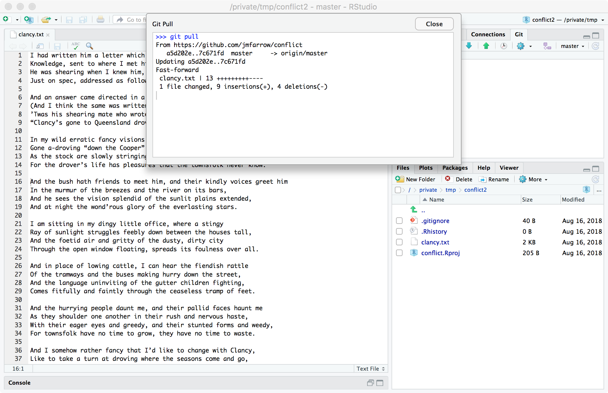{width="100%"}
</div>

User 2 has not made any conflicting changes so there are no further conflicts and all the changes are applied.

In fact, User 2 has not made any changes so no merge is necessary:
_git_ downloads the changes and skips ahead to the latest version.

If we look at User 2's commit history now we can see it's the same as User 1:

<div class="screenshot">
{width="100%"}
</div>

At this point User 1 and User 2 have all the same changes and are up-to-date with respect to each other and the central
remote repository.

## Summary

By tracking all of our changes and where they are,
_git_ can most of the time share those changes between repositories
and apply the changes automatically.

Occasionally, _git_ needs our help because a _conflict_ arises when two conflicting edits have been made to the same thing.

When this happens, _git_ requires us to

  * examine the conflict(s)
  * resolve the conflict(s) by editing the files
  * commit the edits which resolve the conflict

It's usually a good idea to _commit_ immediately and restrict the changes in the _commit_
to just those necessary to resolve the conflict.

Changes would usually then be shared back to the remote repository if necessary using _push._
