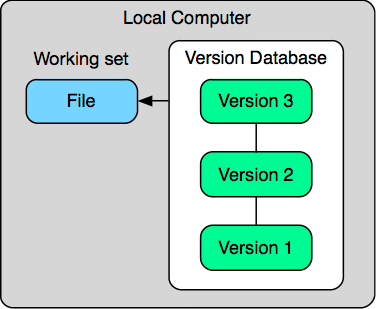
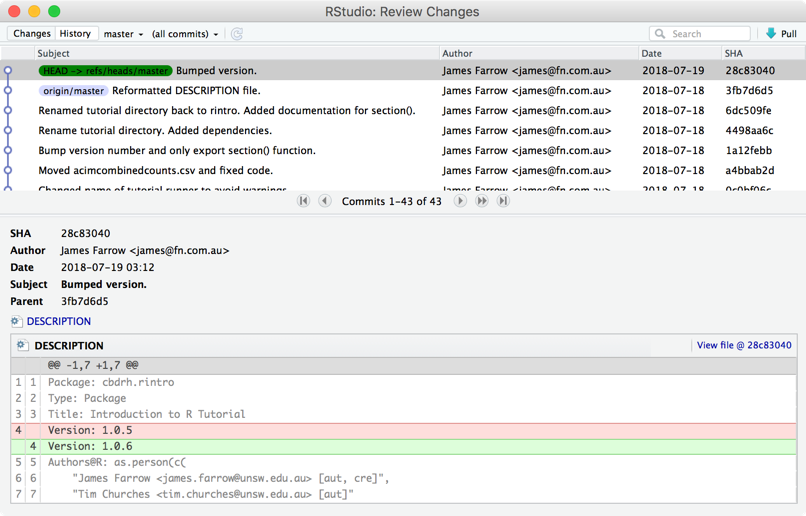

```{r setup, include=FALSE}
library(learnr)
knitr::opts_chunk$set(echo = FALSE)
```

{width="75%"}

## Overview

This tutorial looks at _git_.

_Git_ is a version control system for tracking changes in files and coordinating work on those files among multiple people.
It is primarily used for source code management in software development,
but it can be used to keep track of changes in any set of files.
As a distributed revision control system, it is aimed at speed, data integrity, and support for distributed, non-linear workflows.
This makes it ideal for collaborative development.
(See [Git](https://en.wikipedia.org/wiki/Git) on Wikipedia
and the [git website](https://git-scm.com).)

<span class="copyright">© Copyright 2018 UNSW Sydney. All rights reserved except where otherwise stated.</span>

## Revision management

When we work we create and destroy artefacts over time and change the relationships between them.
This is obviously true for huge projects comprised of many documents and code artefacts and analysis output.
It is also true for 'small' projects and tasks of just a few lines.

By the end of this tutorial, you should be convinced that using a _revision control system_ (like _git_) is a good idea
no matter the size of your project.

### Development is iterative

During the lifetime of a project, many artefacts will be created and destroyed.
This is true whether it be preparing a software application running to millions lines of code,
or a data analysis project comprising perhaps a few thousand lines of code and written material,
or even preparing a textbook containing 'static' text.

Creation is an _iterative_ process,
iteration leads to revision,
revision leads to multiple versions
and we want to prevent multiple versions leading to chaos.

Many projects start out with good intentions and policies but use the wrong tools for the job.
Manually managing revisions using the file system and an _ad hoc_ naming scheme leads to chaos.

A typical project has:

  * _ad hoc_ management of files
  * commented out chunks of old code in scripts
  * copies of older versions ‘just in case’ typically using suffixes on files and directories
    * `.new`, `.old`, `.orig`, `.new.old`, `.new.new`, `.new2`
    * `oldproject`, `project.jun`, `project.0410`

This approach leads to a real mess.

## Revision management philosophy

Using revision control systems involves shifting our thinking from managing copies of files 'beside' one another,
_i.e._ renaming files and keeping a backup copy elsewhere,
to instead thinking about snapshots of all our project files at points in time.

It's up to us to define these 'points of interest' and they can be as frequent or infrequent as we like.
We will see, however, that we need them to be 'frequent enough' but it's also possible to be 'too frequent'.
There's no 'right' answer here about how often we want to take a snapshot, it depends on what we're doing,
so we'll come back to this issue of 'how often' later.

We can think of snapshotting like hitting 'Save' when we're editing a document.
We're quite happy to do this every few minutes and it eventually becomes second nature.
We will get to the point where it becomes second nature after a suitable chunk of work has been completed to describe what we've done
and _commit_ it to our revison control repository.
We end up keeping a history of changes stretching back in time to the start of our project
(or whenever we started tracking the changes).

One advantage of this approach is that we can delete 'old' documents, data and code.
Because we have this history the 'old' stuff is still there and we can reach back and get it at any time
but we don't have to have it cluttering up our current set of working files.

Our projects stays 'clean', everything is recoverable and we don't end up with 800 line documents of which
only 200 lines are actually active and the rest are just commented out but kept 'just in case'.

## Version control systems

Version control systems track changes to directories and files over time.
They generally do this by keeping the state of the project and a history of changes, stored _seperately_ from the current working files.
This has the advantage that the files are 'just the files', there is no special embedded information to track versions.
It also means there's usually a directory somehere in our project that we need to stay out of and not touch.
In _git's_ case this is the `.git` directory in the root folder of our project.

This folder keeps a record of all our changes.
Unlike some version control systems, _git_ keeps an entire copy of the repository locally.
To some extent all copies are equal, no one repository is more special than any other.
This builds in some disaster recovery: if every copy is equal then they're all backups for one another.

<div class="centre">

</div>

Having a full history of a project allows previous versions to be recovered.
Keeping that history in a special place means there's no need for the old versions to clutter up our working set.
If we make mistakes we can 'roll back' to a good version.

<div class="under-the-bonnet">
### Under the bonnet...

Usually revision control systems don't actually keep every version of every file.
They track the _changes_ between files so you'll often see versions referred to as _change sets._
Each change set is the set of changes between the last version and the new version.
When a particular version is requested the revision control system recreates the old version
by taking a later version and applying the changes in reverse.

Of course, this is easy with text files (and almost all programming code files are just text files).
Binary data may not be so amenable to this treatement and may be managed differently.
</div>

## Distributed collaboration

<div class="centre">

</div>

When we collaborate we have multiple people in multiple locations with multiple copies.
This is a much more complicated situation.
We have the problem that authors are making independent edits to code and content and need to share changes with one another.
Sometimes this is done by having a central repository (like a shared drive).
Sometimes this is done by passing a document around from author to author.
Generally, without a proper revision control system, this is done badly.

Common solutions typically involve having a shared document which only one person is allowed to access at a time.
Getting this wrong can result in one author's work being overwritten by another and lost.
Sometime documents are passed around via email.
Getting this wrong can result in multiple copies being extant with no clear idea which is the most recent
and resulting in a big 'merge fest' where all the extant versions need to be merged together.
Shared drives and email are not the right tools for the job.

By passing around changes instead of whole documents, revision control systems make it much easier to collect
separate edits from separate authors together in the one file.
The common case is that different authors are editing different parts of a project and such edits can be managed without conflict.
The less common case, where two different authors edit the same section of the same file, is immediately identifiable
and nothing gets lost because both sets of changes are available to be compared and unified.

A designated central repository can act as a clearing house for these changes.
Note that _git_ does not need a central repository but [_GitHub_](https://githhub.com)
provides a mechanism to have one with convenient associated tools like a wiki and issue tracking.

## Snapshots and changesets

Tracking all of the versions of a project by tracking all the changes makes it easy to see who did what
and when they did it.
It also makes it possible to roll back to previous versions or compare different versions
from different points in a project's history,
_e.g._ comparing a known working past version against a current broken version to see what was changed when and by whom.

If you like, you can think of the repository as a series of snapshots over time.

<div class="centre">

</div>

The repository is like a mini file-system which records all the changes made to it.
Changes to the working set of files are mirrored to the repository using commands like `git add`, `git rm`, `git mv` and so on.
Snapshots at particular points in time are made using `git commit` as desired.

## File workflow

<div class="float-right">

</div>

The basic workflow when working with revision control is as follows:

 * modify files in the local working directory
 * stage files for addition, removal, _&c._
 * perform a commit which makes a snapshot out of the staging area

There are two iterative cycles here

 * we repeat the _modify and stage_ steps multiple times before committing
 * after a commit we return to the _modify and stage_ loop

Quite often, there is no explicit staging step.
Authors make a series of edits and then after a period of time they stage and commit them in one go.

Under this model, files can be in the following states:

 * modified (yet to be staged)
 * staged (yet to be committed)
 * committed (repository up-to-date)

## Adding and removing files

We tell _git_ that files have changes which need to be tracked using `git add`.
We use the `git add` command

 * when we first tell _git_ that a file should be tracked for changes
 * when we make subsequent edits to a file and need to inform _git_

We can tell _git_ to no longer track a file using `git rm`.

It is very important to use `git rm` rather than just remove the file from the file system.
Source control is all about keeping track of changes.
Tracking changes means telling _git_ about those changes.

If we just remove a file, _git_ doesn't know it's been removed because you haven't told it.
Subsequent updates will bring back the last version of the file _git_ knew about.

This kind of deletion is safe though and we shouldn't be afraid of it.
The nice thing about having a full history of a project over time is nothing is gone forever.
We can always get back previous versions of a file.

## Checking file status

<div class="float-right">

</div>

As we add, remove, edit, stage and commit files, the status of a file will change.
From time to time we need to check whether there are changes in a file that we haven't committed yet.
The command `git status` shows this sort of status of files.

This states correspond to changes in the files as follows:

| State       | Meaning                                                        |
|:-----------:|:---------------------------------------------------------------|
| untracked   | _git_ is currently not tracking this file                      |
| modified    | there are edits which are yet to be staged                     |
| staged      | there are staged changes yet to be committed                   |
| unmodified  | the working file, staging area and repository are all the same |

Note that since using `git add` to stage a file and `git commit` to create a snapshot are separate operations,
it's possible for a file to be _staged_ and _modified_ at the same time,
_i.e._ we made some changes, staged those changes using `git add` and then made some more changes without committing.
There is nothing wrong with this situation, it sometimes happens and it can be useful when trying something out.

During a commit, _staged_ files are put into the repository as the next snapshot so if you don't stage
changes, nothing gets committed no matter how many edits you have made.

## The git pane in RStudio

The _git_ pane in RStudio is shown when we have a project open that has been configured to use _git_,
_i.e._ has a `.git` directory created using `git init` either by hand or when the project was set up or initially checked out
from _GitHub._

In the RStudio _git_ pane, the status of a file with respect to the staging area and the local repository
is shown using two columns of status indicators (one for the staging area and one for the local repository)

Let's look at some files in a project and go through each of the files in turn.

<div class="centre">
{width="50%"}
</div>

| File                 | Comment                                                                   |
|:---------------------|---------------------------------------------------------------------------|
| added_for_first_time | A new file we've staged but not yet committed                             |
| deleted              | A file that was in our project which we've delete (but not yet committed) |
| modified             | A file we've modified and not yet staged                                  |
| rename_newname       | A file we renamed (the new name)                                          |
| rename_oldname       | A file we renamed (the old name)                                          |
| staged               | A file we've modifed and staged                                           |
| untracked            | A file in our working directory we haven't told _git_ about yet           |

An unmodified file is not even listed (because there is nothing to do).

Notice that _git_ doesn't really know that we've renamed a file.
From its point of view it looks like a deletion and then the creation of a completely new file it hasn't been told about yet.

<div class="float-right">
{width="407px"}
</div>

However, it does try and detect files that have been renamed by seeing how similar they are.
Files that are mostly similar will be shown as being renamed.
This works quite well when files are moved and not edited at the same time
(it's best to make the move/rename operation part of one commit and any edits part of another for this reason).

Notice how once we schedule those files changes for a commit by adding them (checking the checkbox)
it is displayed as a rename: both parts of the rename operation, the deletion of the old file and the creation of the new file,
need to be part of the same commit for this to work.

This pane also shows an example of a file that has been edited, staged and then edited some more before committing (_remodified_).
A file that has been modified and staged, and subsequently modified again but not yet restaged is shown with a filled checkbox.
Checking the checkbox would make it look exactly like the _staged_ file in this example.

This approach is convenient because it shows the file status at a glance.
Checking a checkbox but since we can tick the box to 'commit everything'
it's easy to see which files we've forgotten to stage.

It also makes it really easy to see files which we've deleted and need to tell _git_ about.
Files deleted are indicated and by checking the checkbox and committing we can inform _git_ about the deletion.

## Committing files

The routine file workflow is thus very simple and not at all intrusive:

<div class="centre">

</div>

It is completely up to the author as to how often to commit. A few comments are in order, however:

 * don't commit so infrequently that commits contain many different logically separate changes to a project
 * don't commit so frequently that a single logical change is spread over multiple commits

One good guide is 'a commit to the master branch should never leave a project in a broken state'.
This means that if things are logically connected and committing them separately is a bad idea.

Of course, sometimes it is necessary to work for an extended period making large scale changes to a project
and we don't want to give up committing during that time but we do want to incorporate all the related changes at once.
_Git_ has a _branching_ mechanism which provides this and we will look at it briefly later.

### Committing in RStudio

There is a commit button in the _git_ pane of RStudio which begins the commit process.
It shows the status of files and allows you to make last minute changes to what you want to commit.
It also has an area to type in a commit message.

<div class="centre">
{width="75%" class="bordered"}
</div>

It is important to check the result of the commit once you press the commit button.

Possible results include

  * everything worked fine
  * you need to configure your name and email address for authorship purposes
  * other file-system related errors

As with any other operation, don't just blindly assume it works.
It usually will but if you don't check you will miss things on the occasions you do need to pay attention to something.

## Commit messages

When we commit we have to supply a message saying what is in the commit, _i.e._ what changes have been made.

Commit messages are very important and it pays to put some thought into them because other people have to read
them to divine the intent of the commit.
One of those other people might be you in six months' time or in a year or more and you'll appreciate
that you took the time to tell your future self what you were thinking.

Here are some examples of some bad commit messages (all taken from real projects)

  * Fixed bug
  * Committed changes
  * asdifhasodifuhaspdifu

These sorts of messages do nothing to inform as to what is in the commit.
'Fixed bug' is way too general.
'Committed changes' is a useless truism.
'asdifhasodifuhaspdifu' is a wilful crime that should be prosecuted to the fullest extent of the law.

Here are some examples of good commit messages:

  * Bump sorting column index by one to fix a problem where the addition of the source study column
    meant tables were no longer sorted by descending time.
  * Added Lesson XLVIII: §§443–452.
    Added colsep option to vocab.
    Surrounded vocab with \begingroup and \endgroup.
    Added paradigm §§760, 761.
    Added gda option to NounLabels.

Each of these commit messages does something to inform and clarify the intent of the changes committed.

The second example is a good commit message but a bad commit.
It probably should have been broken into two or three separate commits:

  * one with the new content
  * one with changes to the vocab command
  * possibly one with changes to NounLabels

Although of course if these things were inextricably tied together then one commit is okay.
There is no one right answer.
Usually the metric is 'what will be convenient in the future?'
Answering this question requires either the benefit of hindsight or experience and experience will come with usage over time.

## The commit log

The `git log` command show us the history of commits.

```
$ git log
commit b026324c6904b2a9cb4b88d6d61c81d16d7fce9f (HEAD -> master)
Author: James Farrow <james@fn.com.au>
Date:   Fri Apr 13 18:15:22 2017 +1000

[TYPES] Refactor extract.py.

commit f3cb6641123c49a8b036b408a548baab47267f03
Author: James Farrow <james@fn.com.au>
Date:   Fri Apr 13 17:59:30 2017 +1000

[TYPES] Add extract type facility to extract.py

commit 1dcca23355272056f04fe8bf20edfce09b6252c8
Author: James Farrow <james@fn.com.au>
Date:   Fri Apr 13 16:57:46 2017 +1000

Better handling of python executable and default_address.py.
```

### The commit log in RStudio

In RStudio the commit history log is accessed through the little clock icon to the left of the gear icon in the _git_ pane.

It displays the commit log and for each entry the differences in that commit.

<div class="centre">

</div>

## Naming revisions

Notice that each commit has a name.
Consider it a long essentially random identifier.

```
$ git log -n 1 b026324c6904b2a9cb4b88d6d61c81d16d7fce9f
commit b026324c6904b2a9cb4b88d6d61c81d16d7fce9f
Author: James Farrow <james@fn.com.au>
Date:   Fri Apr 13 18:15:22 2017 +1000

[TYPES] Refactor extract.py.
```

_Git_ only requires a unique prefix to this long name when you're referring to commits
so usually you’ll be using and seeing shorter references to commits like `b026324`

```
$ git log -n 1 b026324
commit b026324c6904b2a9cb4b88d6d61c81d16d7fce9f
Author: James Farrow <james@fn.com.au>
Date:   Fri Apr 13 18:15:22 2017 +1000
[TYPES] Refactor extract.py.
```

If the name isn't unique enough, _git_ will complain

```
$ git log -n 1 b02
fatal: ambiguous argument 'b02': unknown revision or path not in the working tree.
Use '--' to separate paths from revisions, like this:
'git <command> [<revision>...] -- [<file>...]'
```

<div class="under-the-bonnet">
### Under the bonnet...

A _git_ commit id is actually a SHA-1 hash of important bits of information about the commit, including but not limited to:

  * the full content of the commit
  * the date of the commit
  * the authorship information
  * the log message
  * ids of previous commits to get to this point

If any of this information changes the commit id will change.
There is some other information that ensures the same commit on different machines will get a different id.

All of this helps to make _git_ very fast and efficient when comparing repositories and change histories.
</div>

### Revision references

We can of course refer to revisions by those specific long ids if we really want to
but _git_ gives us other, more convenient, ways to talk about revisions.

`HEAD` is the current revision that you’re working on.

The name of a branch, _e.g._ `master` can be used to refer to the latest revision on that branch.
We'll look at branches in more detail presently.
The `master` branch is the branch created by default in a new repository to contain all the work.

`HEAD` is not always the same as the end of the master branch,
_i.e._ the most recent main revision but in our case it usually will be for now.

All of these references are _local_ to a particular repository,
_i.e._ my `HEAD` may be different to your `HEAD` because I might be working somewhere different in the repository
instead of on the most recent version;
if we're not up-to-date with respect to each other the end of my `master` branch could be different to
the most recent entry at the end of your `master` branch.

In this scenario

<div class="centre">

</div>

  * `master` would refer to commit `9a0b299`
  * `experimental` would refer to commit `05f2b1f`

This repository seems to currently be editing the end of the `master` branch so `HEAD` would be the same as master: `9a0b299`

The good news is you don’t really need to remember these details right now,
just rest assured that _git_ is more than capable of managing quite complex changes and tracking everything that has gone on.

Because _git_ has a picture of everything that has happened and how a document went
from version A to version B it gives us great control over our documents.

### Some useful notations for referring to commits

Adding `^` to the end of a reference means 'one commit earlier'
so `HEAD^` means 'the revision previous to the one I'm working on'
while `master^` means 'the revision just before the latest on the master branch'.

Adding `@{...}` after a reference allows time-based expressions, for example

  * `master@{yesterday}`
  * `HEAD@{one month ago}`

Note that if your expression has a space in it you might need to surround it with quotes if you're using the command line.

We can use references like these to help compare files and see what has changed.


## Complex workflows

Keeping a history of each file in a project allows us to do a lot of things:

  * compare different versions of files
  * return to previous working versions
  * safely try out an approach to see if it works and rollback if not
  * have multiple people work on a project concurrently without overwriting each other's files

## Finding differences

The `git diff` command shows us what has changed in a file.
There are lots of ways to use `git diff` but here are some important ones.
Each of these takes an optional list of files.
If no files are specified then all files are compared.

```
git diff [file ...]
```

This form is to view the changes you made relative to the staging area for the next commit.
In other words, the differences are what you could tell _git_ to further add to the staging area but you still haven't.

```
git diff <commit> [--] [file ...]
```

This form is to view the changes you have in your working tree relative to the named commit.
You can use `HEAD` to compare it with the latest commit, or a branch name to compare with the tip of a different branch.

For example, `git diff HEAD functions.R` would compare `functions.R` to the last commit,
`git diff HEAD@{yesterday}` would compare everything to how it was a day ago.
           
```
git diff <commit> <commit> [--] [file ...]
```

This form shows the differences between two arbitrary commits.
For example, if we had two named revisions (we can _tag_ revisions to give them useful names)
`git diff v_2.0 v_2.1 functions.R` would show the differences between the `functions.R` file in the `v_2.0` revision and the `functions.R` file in the `v_2.1` revision.

### Viewing diffs in RStudio

There is a diff button next to the commit button in RStudio's _git_ pane.
It brings up a new window where one can scroll back and forth through the project history in the _History_ tab.
The _Changes_ tab allows the differences for a particular file to be examined.

<div class="centre">

</div>

## Reverting

The `git checkout` command lets us pull specific files out of the repository from a specific commit using

```
git checkout <commit> file ...
```

This pulls a specific version of a file out of the repository and replaces the current version of the file.

<div class="aside">
### An aside...

Note that the file name is necessary.

Without a filename `git checkout` moves the entire repository to the specified commit.
Since this is a previous point in time,
attempts to commit to new work will give probably unexpected results.
An indicator that you may have done this is a message that 'You are in "detached HEAD" state.',
which is not as alarming as it sounds.
If you do this by accident, running `git checkout master` (or whatever branch you are on) will return the `HEAD`
to the tip of the `master` branch and work can resume.
</div>

**Any uncommitted work will be lost: if in doubt commit first.**

If, for example, we found that we had completely damaged a file and wanted to go back to the way it was yesterday
and throw away all our changes we could run

```
git checkout "HEAD@{yesterday}" helpers.R
```

Being able to revert changes makes revision control very powerful.

Of course as mentioned, this only works when we have sensible commit sizes:

  * too big and too many changes are lumped together which makes them hard to untangle
  * too small and it becomes inconvenient as changes are spread over multiple commits

## Branching

<div class="float-right">

</div>

Repositories contain our 'master' copy of our project.
Repositories can also contain 'experimental' versions of our projects.

Sometimes we want to 'try something out'. 
Rather than disrupt everyone by putting our experiments into `master` (which may well break everything) we use a _branch_.

The default `master` branch is where work usually occurs but different projects have different conventions:

  * some projects have a `develop` branch and only put stable versions on the `master` branch
  * some projects do all their work on the `master` branch and push stable versions to a `stable` or `release` branch
  * some projects create and destroy branches for every new thing.

It is a good idea to create a new branch for each release so that fixes can be made to the exact version of the project, even when research and development has moved on.

Branches split off from the default ‘master’ copy initially and from each other.

Weird and wonderful experimentation can take place on branches insulating the `master` version of a project from disruption and harm.

Once work is complete:

  * work can be folded back into the ‘master’ copy, or
  * work can be ignored and abandoned (but not forgotten)

### Branch structure

Branches have the same structure as the trunk from which they are spawned.
In fact, at the point of branching they are identical.

Branching is not taking a copy of a project and calling it `my_project_v2` and placing it in a different directory,
or saving 'the important bits' of a project on an external or network drive.

Instead, branching is having two versions which can be swapped back and forth at will.

Keeping the same structure facilitates comparing two branches to see exactly what has changed.

### RStudio commit log with branches

In RStudio the commit log shows branching and merges with ribbons.

<div class="centre">

</div>

### Summary

We’re not going to look at branching in any more detail but be aware that it exists.

It's a powerful mechanism to make major changes to a project while isolating those changes so that they don’t affect everyone else.

It's also a good mechanism to make major changes and keep them separate from your own work on the mainline project development:
instead of working for days and not saving ‘because you don’t want to overwrite the original’
or saving a copy as `my_prog.experimental.R` 'to keep it separate',
we can continue to work on `my_prog.R` and continue to exploit the benefits of regular commits.

## Remote repositories

So far we have just talked about working within a local repository.

However, since we have been collecting a list of changes made to our project over time
we can also 'push' and 'pull' these changes between repositories.

We call repositories that aren’t the local repository _remote repositories_.
Remote repositories are important for collaboration as they give us a central clearing house for changes.

Often a central repository will have a web interface so that the project and revision can be viewed and managed
independently of a particular local copy.
They can also offer extra features like a wiki or an issue tracking system (GitHub offers both of these).
They can sometimes provide permissions around who is allowed to do what with different branches,
_e.g._ everyone can work on the `research` branch but only certain people can incorporate changes into the `published` branch.

<div class="float-right">

</div>

Let's revisit our file workflow with collaboration in mind.

Here we can see our _add_ and _commit_ operations affecting our local working set, staging area and repository.

We can also see that _checkout_ is taking information from our local copy of the repository
and _diff_ is comparing local copies.

New in this workflow are _push_ and _pull_.

The commands `git push` and `git pull` move changes between repositories and incorporate those changes into the local copy.

_Git_ ensures that before we do a _push_ operation our local repository is completely up-to-date
with respect to theremote repository.
If it is not it informs us that we need to _pull_ before it will allow us to _push_.
It does this to make sure there there are no conflicting edits that need to be resolved.

Doing the _pull_ first makes sure that conflicts are noticed on your machine and you get the chance to fix them.
If the _push_ were allowed first, conflicts would have to be recorded remotely but left to be solved later.
A situation could easily arise where conflicting edit after conflicting edit are pushed to the remote repository
creating a complete mess which never gets resolved.

If conflicts do arise because of a _pull_ operation we can (and must) fix them before moving on.

## Conflicts

<div class="float-right">
{width=445px}
</div>

Fixing conflicts _is just like any other edit operation_: the aim is to leave the project in a consistent sensible state.

Conflicts are indicated in the text surrounded by marker character strings `<<<<<<<`, `=======` and `>>>>>>>`

```
<<<<<<< HEAD
my changes
=======
pulled changes
>>>>>>> be2b0441bebfb70c6eef9827678bbb12f149bf4d
```

The aim is to replace this entire section with the 'correct' version.
What is 'correct' is entirely up to you.

  * You might decide your changes are better than the remote changes you're pulling in so you delete the markers and the second chunk of text
  * You might decide that the remote changes are better and your changes are garbage so you keep the second chunk and delete the first
  * You might need to incorporate changes from both, replacing the entire section
  * You might come up with a completely new replacement that is nothing like either of them
  * You might decide to delete both changes altogether
  
There is no single right answer.

To resolve the conflict, _edit_, _add_ and _commit_ as usual.

Note that there may be more than one set of conflicts in a file.
Make sure you get them all by searching for the `<<<<<<<` markers.

### Conflicts in RStudio

Conflicts are indicated using an unresolved status in the _git_ pane.

<div class="centre">
{width="75%"}
</div>

**It is important not to just check the checkbox and commit.**

This will lead to the `<<<<<<<`, `=======` and `>>>>>>>` markers and the multiple copies of the code getting committed.
This will in turn lead to more conflicts down the track with nested marks and not-so-hilarious results. Your colleagues will not thank you.

Edit the file to fix the conflict, and then commit.

## Collaborative workflow

<div class="float-right">

</div>

Our workflow now looks like this.

It's still the same basic _edit/commit_ cycle augmented with an occasional _push_ and _pull_.

## Activity

This is a simple exercise in adding and committing files in RStudio.

  * Create a new project in RStudio and enable _git_
  * Create some new text and/or R files in the project
  * Add them using the _git_ pane
  * Commit them with a sensible commit message
  * Make changes to the file and commit the new changes
  * Repeat this a few times
  * View the history log of your project

Some additional things to try

  * Try deleting a file in the _Files_ tab and then committing the deletion
  * Try renaming a file and committing the rename

## Summary

This concludes our overview of _git_.

More good tutorials on _git_ are available online:

  * The [_git_ website](https://git-scm.com/doc)
  * [Atlassian](https://www.atlassian.com/git) (aimed at _BitBucket_ rather than _GitHub_ but still useful)