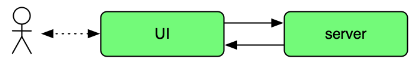
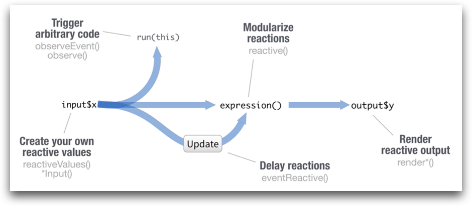

```{r setup, include=FALSE}
library(learnr)
knitr::opts_chunk$set(echo = FALSE)
library(datasets)
library(shiny)
```

{width="75%"}

## Overview

> "We can never control change; we can only control our response to change."

This tutorial discusses reactivity in the RShiny application framework:
the process by which outputs are recalculated or code can be configured to run when inputs change.

<span class="copyright">© Copyright 2018, 2019, 2021, 2022 UNSW Sydney. All rights reserved except where otherwise stated.</span>

## Reactivity

Recall that Shiny apps consist of a _user-interface_ running in a user's browser
and a _server_ application with which it communicates.

<div align="center">
{width="50%"}
</div>

_Inputs_ in the UI are controlled by the user.
Their values are sent to the server which generates _outputs_.
The outputs are sent back to the UI.
The UI displays these outputs.

Input changes force output updates.
Consider the following application with the server code

```
server <- function(input, output) {
  output$example1.hist <- renderPlot({
    break.fn <- function(x) {
      seq(min(x), max(x), length.out = input$example1.bins + 1)
    }
    hist(rnorm(1000), breaks=break.fn)
  })
}
```

and the UI as follows:

<div class="bordered-container-fluid">
```{r example1-ui, echo=TRUE}
fluidPage(
  p(sliderInput("example1.bins", "No. of bins", value=5, min=5, max=21)),
  p(plotOutput("example1.hist"))
)
```
</div>

```{r example1-server, context="server"}
output$example1.hist <- renderPlot({
  break.fn <- function(x) {
    seq(min(x), max(x), length.out = input$example1.bins + 1)
  }
  hist(rnorm(1000), breaks=break.fn)
})
```

<p>Changes to the input `input$bins` will result in a change to the output `output$hist`.

Try it by changing the slider.
The graph will update automatically.

Shiny keeps track of these values which can change,
and which will change depending on other values changing.

These types of data items are called _reactive values_ and must be used inside _reactive functions_ like `renderPlot()`.

<div class="under-the-bonnet">
### Under the bonnet

It may be helpful to some to explain the non-Shiny bits of the above example.

Here:

 * we are creating a function to calculate the breakpoints for our histogram
 * we pass this function `break.fn` as the arguments `breaks` to `hist`
 * the breakpoint calculation function takes one argument: the list of values in the histogram
 * here we want n equal-width bins so we take the minimum and maximum values in our value list and compute breakpoints accordingly using `seq()`
</div>

## Reactive functions

Reactive functions take reactive values (usually inputs) and calculate new reactive values (_e.g._ outputs).

A code chunk is provided to a reactive function as an closure argument,
a chunk of code surrounded by `{...}`.

In the following example

```
function(input, output) {
  output$hist <- renderPlot({
    hist(rnorm(input$num))
  })
}
```

we can see that `renderPlot()` takes a closure as its argument: the chunk of code `{ hist(rnorm(input$num)) }`.

Shiny scans this closure for reactive data values so it can work out when it needs to recalculate things.

In this case it will find `input$num` and it knows that when `input$num` changes,
a new value will need to be created for `output$hist` by executing the closure (running the supplied code chunk).

Note that the entire code chunk will be executed.

This is important to remember because if the closure is doing a lot of work, _all_ that work is repeated each time.

Also, if the closure is doing anything random, new random values will be generated each time.
This may not always be what we want.

All of the 'render' functions are reactive functions:

 * `renderDataTable()`
 * `renderImage()`
 * `renderPlot()`
 * `renderPrint()`
 * `renderTable()`
 * `renderText()`
 * `renderUI()`

## Unnecessary computation

Having Shiny keep track of these dependencies for us is extremely convenient but the choices it makes are not always desirable.

This can lead to a lot of unnecessary extra computation if we aren't careful with the way we construct out dependencies.

We may be able to look at a closure containing multiple calculations based on two values from two input
and know that only one value will change at a time but since we've put everything in one closure
Shiny has to rerun the entire closure every time.
Sometimes it can be helpful to split things into separated closures.

In this example:

```
computed.value1 = input$value1 + 5
computed.value2 = input$value2 + 10
output$result = computed.value1 + computed.value2
```

Everything gets recalculated no matter which input changes even though only half the work needs to be done each time
since the other value hasn't changed.
This is a trivial example but it illustrates the principle.

Sometimes we only want to redo part of the work because only some inputs have changed.

Sometimes we don't want to do _any_ work until a specific event.
For example, we might have 4 inputs controlling a map but we don't want to redraw the map every time one of the inputs changes
only when the user has set all four inputs and then triggers a map redraw.

Not all unnecessary computation is related to input dependencies.

Consider the following code:

```
output$popmap <- renderLeaflet({

  CED_polyinfo <- CED_info %>%
    mutate(CED_CODE_2016 = paste0("CED", CED_info$CED_CODE_2016)) %>%
    group_by(CED_CODE_2016, CED_NAME_2016) %>%
    summarise(total_area = sum(AREA_ALBERS_SQKM)) %>%
    left_join(CED_popinfo) %>%
    mutate(pop_density = Tot_P_P / total_area)
    
  # let's use white -> orange
  pop_pal <- colorNumeric(c(input$zeropopcolour, input$maxpopcolour),
    c(0, input$maxpop))
    
  # join the CED info to our polygons plotting
  Sydney_polys@data <- left_join(Sydney_polys@data, CED_polyinfo)
  
  # draw our map
  leaflet() %>% ...

})
```

Notice the first statement, the assignment to `CED_polyinfo`

 * does a reasonable amount of work; and
 * does not depend on any inputs.

In other words, the value it computes does not change.
This is not only also true of the calculation involving `Sydney_polys@data` but in that case we don't want to do that multiple times.

This sort of code should not be in the closure passed to the reactive function as it results in unnecessary computation.

The rest of the code depends on three inputs:

 * zeropopcolour
 * maxpopcolour
 * maxpop
 
 And we want the output to be redrawn only whenever any of these change.

## Dependencies and randomness

Consider:

```
output$hist <- renderPlot({
  hist(rnorm(input$num))
})

output$summary <- renderPrint({
  summary(rnorm(input$num))
})
```

We’re calling `rnorm()` twice here.

Not only that, presumably we were trying to display some summary information and a histogram about the same 1000-element random sample.

However, in this case, each call to `rnorm()` will produce a _different_ sample of 1000 numbers.

The stats displayed will be about a different sample to the one displayed in the histogram!

<div class="bordered-container-fluid">
```{r rnorm1-ui, echo=TRUE}
fluidPage(
  p(sliderInput("rnorm1.num", "Sample size", value=100, min=100, max=1000, step=100)),
  p(plotOutput("rnorm1.hist")),
  p(textOutput("rnorm1.summary"))
)
```
</div>

```{r rnorm1-server, context="server"}
output$rnorm1.hist <- renderPlot({
  hist(rnorm(input$rnorm1.num))
})

output$rnorm1.summary <- renderPrint({
  summary(rnorm(input$rnorm1.num))
})
```

<p>If you play with the above example and move the slider you will quickly come across a situation where the minimum and/or maximum
in the summary are not the same as in the histogram.

## Custom reactive functions

We can write our own _reactive functions_ that behave like `renderPlot()` and its friends.

Reactive functions

 * remember their results
 * they return this same result without executing until their inputs change
 * when the inputs have changed the closure is rerun and the new computer value remembered

Let's rewrite our `rnorm()` example to remove the problem of the histogram and the summary referring to difference sets of numbers.

```
data <- reactive({
  rnorm(input$rnorm2.num)
})

output$rnorm2hist <- renderPlot({
  hist(data())
})

output$rnorm2.summary <- renderPrint({
  summary(data())
})
```

Here we have created our own reactive function `data()` which depends on `input$rnorm2.num`.

When `input$rnorm2.num` changes it will invalidate `data()` (and transitively also invalidate `output$rnorm2.hist` and `output$rnorm2.summary`)
so all three of these will need to be recalculated.

Let's imagine `output$rnorm2.hist` is recalculated first.
(It's important to realise it may not be.
Just because it's listed first in our code doesn't mean it will be recalculated before `output$rnorm2.summary`.)
When `data()` is called, it will also be recalculated, `rnorm()` will be called and a new set of sample numbers generated.

When `output$rnorm2.summary` is recalculated next, `input$rnorm2.num` _has not changed_ so `data()` will return the previously computed sample.

In this way `hist()` and `summary()` will end up using _the same sample set_.

Try it now:

<div class="bordered-container-fluid">
```{r rnorm2-ui, echo=TRUE}
fluidPage(
  p(sliderInput("rnorm2.num", "Sample size", value=100, min=100, max=1000, step=100)),
  p(plotOutput("rnorm2.hist")),
  p(textOutput("rnorm2.summary"))
)
```
</div>

```{r rnorm2-server, context="server"}

data <- reactive({
  rnorm(input$rnorm2.num)
})

output$rnorm2.hist <- renderPlot({
  hist(data())
})

output$rnorm2.summary <- renderPrint({
  summary(data())
})
```

<p>Notice the results are consistent now.

Reactive function _cache_ their results.
If they are not dependent on any inputs then they calculate their value once and never change.

```
get_CID_info <- reactive({
  CED_info %>%
    mutate(CED_CODE_2016 = paste0("CED", CED_info$CED_CODE_2016)) %>%
    group_by(CED_CODE_2016, CED_NAME_2016) %>%
    summarise(total_area = sum(AREA_ALBERS_SQKM)) %>%
    left_join(CED_popinfo) %>%
    mutate(pop_density = Tot_P_P / total_area)
})
```

This code has no input dependencies and so will never be invalidated.

It’s used to cache the final value and avoid recomputing it unnecessarily.

We would call it as `get_CID_info()`.

## Preventing reactivity

Sometimes we want to stop_ Shiny from recomputing values when things change.

The `isolate()` function takes a closure and creates a value from which is non-reactive.

Notice in this example that the histogram gets recomputed when `input$isolate.num` gets changed
but not when `input$isolate1.title` is changed.
That change doesn't get picked up until the next time the histogram is recomputed (when the `input$isolate.num` changes).

```
output$isolate1.hist <- renderPlot({
  hist(rnorm(input$isolate1.num), main = isolate({input$isolate1.title}))
})
```

<div class="bordered-container-fluid">
```{r isolate1-ui, echo=TRUE}
fluidPage(
  p(sliderInput(inputId = "isolate1.num",
              label = "Choose a number",
              value = 25, min = 10, max = 100, step=5)),
  p(textInput(inputId = "isolate1.title",
            label = "Write a title",
            value = "Histogram of Random Normal Values")),
  p(plotOutput("isolate1.hist"))
)
```
</div>

```{r isolate1-server, context="server"}
output$isolate1.hist <- renderPlot({
  hist(rnorm(input$isolate1.num), main = isolate({input$isolate1.title}))
})
```

## Responding to events

Sometimes we don't want to do _any_ recalculation until the user triggers it.

For example, we might want to have an update button as part of the interface.

We can use an `observeEvent()` reactive function to do this.

The function `observeEvent()` takes two arguments

 * a vector of values to monitor (may also be a single value)
 * a closure to execute
 
When any of the inputs change, the closure is executed.

<div class="bordered-container-fluid">
```{r observeEvent-ui, echo=TRUE}
fluidPage(
  p(),
  p("Press the button:", actionButton(inputId = "observeEvent.clicks", label = "Click me"))
)
```
</div>

```{r observeEvent-server, context="server"}
observeEvent(input$observeEvent.clicks, {
  print(input$observeEvent.clicks[[1]])
})
```

<p>```
observeEvent(input$observeEvent.clicks, {
  print(input$observeEvent.clicks[[1]])
})
```

The `observeEvent()` (and `observe()`, see below) reactive functions do not generate a result
hence there is no assignment to any `output$` slot.

These functions are called purely for their side-effects.

If you try the above example by clicking the _Click me_ button you will see output in the RStudio window.

There is also a version of this observer reactive function called `observe()` which only takes a closure.
It tracks all inputs in the closure and therefore doesn't take a first argument.

```
observe({
  ...
})
```

If we do want to calculate a result, there is similar function to `observeEvent()` called `eventReactive()` which
takes as its first argument the values to monitor.

Let's create a version of our histogram example with a slider and title but which only updates when a button is pressed.

```
data <- eventReactive(input$on.demand.go, {
  rnorm(input$on.demand.num)
})

output$on.demand.hist <- renderPlot({
  hist(data())
})
```

<div class="bordered-container-fluid">
```{r on.demand-ui, echo=TRUE}
fluidPage(
  p(sliderInput(inputId = "on.demand.num",
              label = "Choose a number",
              value = 25, min = 10, max = 100, step=5)),
  p(actionButton(inputId = "on.demand.go", label = "Update")),
  p(plotOutput("on.demand.hist"))
)
```
</div>

```{r on.demand-server, context="server"}
data <- eventReactive(input$on.demand.go, {
  rnorm(input$on.demand.num)
})

output$on.demand.hist <- renderPlot({
  hist(data())
})
```

So we have two function which can be used to execute code reactively and don't return a value

 * `observe()`
 * `observeEvent()`

and two corresponding functions which can be used to execute code reactively and do return a value

 * `reactive()`
 * `eventReactive()`

## Non-input reactive values

We can create our own reactive values which behave to shiny the same way but which are not connected to inputs.

The `reactiveValues()` function creates a list of reactive values which can be used like inputs.

```
rv <- reactiveValues()
```

We can add new reactive values to this list later using the $ syntax

```
rv$data = rnorm(100)
```

It can be given a list of initial values

```
rv <- reactiveValues(data = rnorm(100))
```

We can use these variables in our code and assign to them to trigger reactive updates of dependent values.

```
rv <- reactiveValues(data = rnorm(100))

observeEvent(input$reactiveValues.norm, {rv$data <- rnorm(100)})
observeEvent(input$reactiveValues.unif, {rv$data <- runif(100)})

output$reactiveValues.hist <- renderPlot({
  hist(rv$data)
})
```

<div class="bordered-container-fluid">
```{r reactiveValues-ui, echo=TRUE}
fluidPage(
  p(actionButton(inputId = "reactiveValues.norm", label = "Normal")),
  p(actionButton(inputId = "reactiveValues.unif", label = "Uniform")),
  p(plotOutput("reactiveValues.hist"))
)
```
</div>

```{r reactiveValues-server, context="server"}
rv <- reactiveValues(data = rnorm(100))

observeEvent(input$reactiveValues.norm, {rv$data <- rnorm(100)})
observeEvent(input$reactiveValues.unif, {rv$data <- runif(100)})

output$reactiveValues.hist <- renderPlot({
  hist(rv$data)
})
```

## Reactivity overview

Carefully consider the data flows in your application and where reactivity needs to occur.

<div align="center">
{width="75%"}
</div>

 * what needs to respond to changes in inputs?
 * should those changes be automatic or manually configured?
 * what computation can be cached using reactive values?

Try and minimise how often code is run.

There are three places to put code which affects how often it is executed:

 * code outside of the server function gets run once per session
 * code inside the server function gets run once per user (connection)
 * code inside a reactive function get run once per reaction (value change)

## Summary

This concludes our tutorial on reactivity in Shiny.

Shiny applications:

 * keep track of the relationship between inputs and outputs
 * recalculate outputs automatically when inputs change
 * can be told not to respond to changing data using _isolate()_
 * can be given code chunks to run when certain inputs and other data change
 
Also

 * try and minimise how often code is run
 * the placement of code in your application determines how often it might be executed
